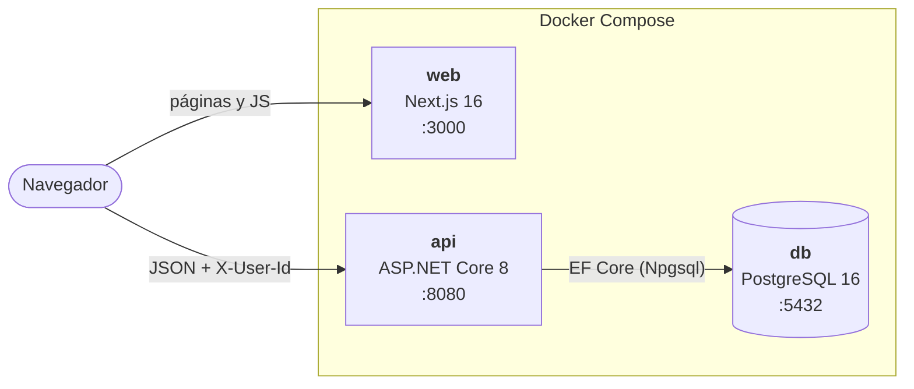
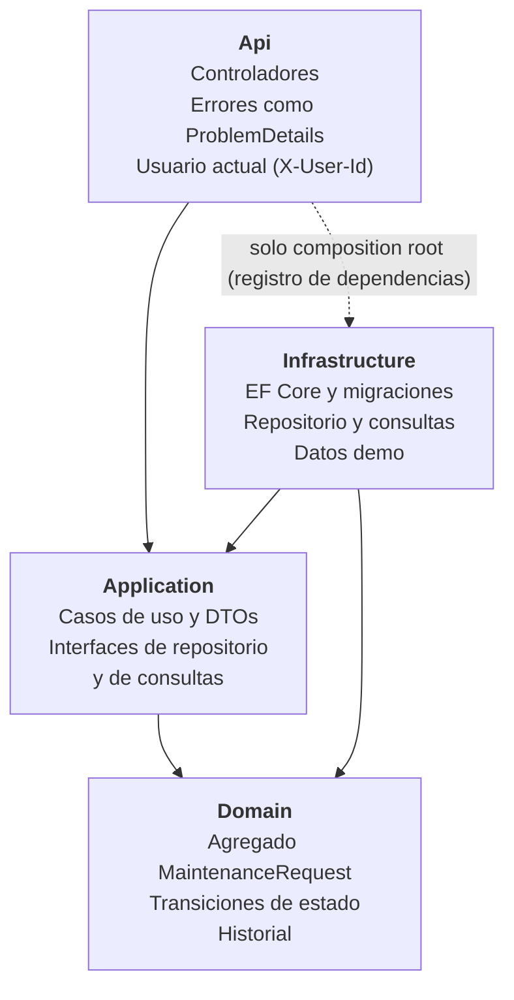

# Solicitudes de mantenimiento

Aplicación para registrar solicitudes de mantenimiento y seguirlas hasta su cierre: estados con transiciones controladas, responsable asignable e historial de cada cambio.

**Stack:** API en .NET 8 (ASP.NET Core, EF Core 8, PostgreSQL 16) con arquitectura en capas y DDD táctico; web en Next.js 16 (React 19, TypeScript, Tailwind CSS 4, TanStack Query); todo orquestado con Docker Compose.

## Contenido

1. [Requisitos](#requisitos)
2. [Ejecución](#ejecución)
3. [Variables de entorno](#variables-de-entorno)
4. [Pruebas](#pruebas)
5. [Contrato de la API](#contrato-de-la-api)
6. [Autenticación simulada](#autenticación-simulada)
7. [Supuestos de negocio](#supuestos-de-negocio)
8. [Arquitectura](#arquitectura)

## Requisitos

- **Docker** con **Compose v2** (`docker compose`, no `docker-compose`).
- **.NET 8 SDK**, solo para correr las pruebas. Sirve cualquier versión 8.0.x.
- Puertos **3000** (web), **8080** (API) y **5432** (PostgreSQL) libres. Si alguno está ocupado, se cambia en `.env` (ver [Variables de entorno](#variables-de-entorno)).

## Ejecución

```bash
cp .env.example .env
docker compose up --build
```

El primer arranque aplica las migraciones y siembra datos de demostración: 5 usuarios y 30 solicitudes en distintos estados.

| Servicio | URL |
|---|---|
| Web | http://localhost:3000 |
| API | http://localhost:8080 |
| Swagger | http://localhost:8080/swagger |

En la web, elige un usuario en el selector **"Actuando como"** del encabezado para crear solicitudes, cambiar su estado o asignarlas.

Para empezar de cero con la base vacía (se vuelve a sembrar al arrancar):

```bash
docker compose down -v
docker compose up --build
```

Si falta el `.env`, Compose se detiene con el mensaje `Copia .env.example a .env`.

### Desarrollo local sin contenedores para la API y la web

Solo la base corre en Docker; la API y la web corren en la máquina con recarga en caliente.

```bash
# 1. Base de datos
docker compose up -d db

# 2. API en http://localhost:5184 (perfil "http": migra, siembra y habilita Swagger)
dotnet user-secrets set "ConnectionStrings:Default" "Host=localhost;Port=5432;Database=maintenance_requests;Username=maintenance;Password=change_me" --project src/MaintenanceRequests.Api
dotnet run --project src/MaintenanceRequests.Api --launch-profile http

# 3. Web en http://localhost:3000
cd web
echo "NEXT_PUBLIC_API_URL=http://localhost:5184" > .env.local
npm install
npm run dev
```

La cadena de conexión va en *user-secrets* (o en la variable `ConnectionStrings__Default`), nunca en `appsettings.json`. Los valores del ejemplo son los de `.env.example`; si cambiaste el `.env`, usa los tuyos.

## Variables de entorno

Todas viven en `.env`, que se crea a partir de `.env.example` y no se versiona.

| Variable | Uso | Valor de ejemplo |
|---|---|---|
| `POSTGRES_USER` | Usuario de PostgreSQL. La API arma su cadena de conexión con estas tres variables. | `maintenance` |
| `POSTGRES_PASSWORD` | Contraseña de PostgreSQL. | `change_me` |
| `POSTGRES_DB` | Nombre de la base de datos. | `maintenance_requests` |
| `DB_PORT` | Puerto del host para PostgreSQL. Solo escucha en `127.0.0.1`. | `5432` |
| `API_PORT` | Puerto del host para la API. | `8080` |
| `WEB_PORT` | Puerto del host para la web. | `3000` |
| `APPLY_MIGRATIONS` | Aplica las migraciones pendientes al arrancar la API. | `true` |
| `SEED_DEMO_DATA` | Siembra las solicitudes de demostración si la tabla está vacía. | `true` |
| `ENABLE_SWAGGER` | Publica Swagger en `/swagger`. | `true` |
| `CORS_ALLOWED_ORIGINS` | Orígenes que pueden llamar a la API, separados por coma. `*` no se acepta. Debe coincidir con `http://localhost:${WEB_PORT}`. | `http://localhost:3000` |
| `NEXT_PUBLIC_API_URL` | URL de la API que usa el navegador. Se incrusta al construir la imagen web, así que debe coincidir con `http://localhost:${API_PORT}` y cambiarla exige `docker compose up --build`. | `http://localhost:8080` |

Si cambias `API_PORT` o `WEB_PORT`, ajusta también `NEXT_PUBLIC_API_URL` o `CORS_ALLOWED_ORIGINS`.

Compose fija además, para la API, `ASPNETCORE_ENVIRONMENT=Production`, `ASPNETCORE_HTTP_PORTS=8080` y `ConnectionStrings__Default`, apuntando al servicio `db`.

## Pruebas

Desde la raíz del repositorio:

```bash
# Unitarias del dominio (no requieren Docker)
dotnet test tests/MaintenanceRequests.UnitTests

# Integración de la API contra un PostgreSQL real (requieren Docker encendido)
dotnet test tests/MaintenanceRequests.IntegrationTests

# Todas
dotnet test
```

- **Unitarias:** reglas del agregado. Cubren validaciones de título y descripción, las 7 transiciones permitidas y las 18 rechazadas, la asignación y las propiedades calculadas.
- **Integración:** levantan la API completa con `WebApplicationFactory` contra un PostgreSQL 16 efímero de Testcontainers. Cubren:
  - el flujo principal: crear (201 con `Location`), cambiar de estado, leer el historial con sus actores y rechazar una transición inválida sin tocar el historial;
  - el conflicto de concurrencia con una versión vieja;
  - que los campos que no controla el cliente (`id`, `status`, `createdAt`) se ignoren al crear;
  - el 401 sin usuario y el 400 con errores por campo;
  - que un fallo al guardar el historial no deje el cambio de estado ni la asignación a medias.

## Contrato de la API

Base: `http://localhost:8080`. Los enums viajan como texto (`"InProgress"`) y los errores siguen [ProblemDetails (RFC 9457)](https://www.rfc-editor.org/rfc/rfc9457), con un `traceId` para rastrearlos en los logs.

| Método | Ruta | Descripción | `X-User-Id` | Respuestas |
|---|---|---|---|---|
| `GET` | `/api/maintenance-requests` | Listado paginado con filtros | No | 200, 400 |
| `GET` | `/api/maintenance-requests/summary` | Totales por estado (globales) | No | 200 |
| `GET` | `/api/maintenance-requests/{id}` | Detalle con historial | No | 200, 404 |
| `POST` | `/api/maintenance-requests` | Crea una solicitud en `Pending` | Sí | 201, 400, 401 |
| `PATCH` | `/api/maintenance-requests/{id}/status` | Cambia el estado | Sí | 200, 400, 401, 404, 409 |
| `PATCH` | `/api/maintenance-requests/{id}/assignee` | Asigna o reasigna el responsable | Sí | 200, 400, 401, 404, 409 |
| `GET` | `/api/users` | Catálogo de usuarios | No | 200 |

**Parámetros del listado:** `page` (desde 1), `pageSize` (1 a 50, por defecto 10), `status`, `priority`, `category`, `search` (contiene, en el título) y `sortDirection` (`desc` por defecto o `asc`, por fecha de creación). La respuesta trae `items`, `page`, `pageSize`, `totalCount` y `totalPages`.

**Valores:**
- `status`: `Pending`, `InProgress`, `OnHold`, `Resolved`, `Cancelled`.
- `priority`: `Low`, `Medium`, `High`, `Critical`.
- `category`: `Infrastructure`, `Equipment`, `Software`, `Other`.

**Transiciones permitidas** (cualquier otra devuelve 409):

| Desde | Hacia |
|---|---|
| `Pending` | `InProgress`, `Cancelled` |
| `InProgress` | `OnHold`, `Resolved`, `Cancelled` |
| `OnHold` | `InProgress`, `Cancelled` |
| `Resolved`, `Cancelled` | Ninguna: son estados finales |

El detalle incluye `allowedTransitions` y `canAssign`, para que el cliente no tenga que replicar estas reglas, y `version`, que se reenvía en cada cambio.

### Ejemplo: crear una solicitud

```bash
curl -X POST http://localhost:8080/api/maintenance-requests \
  -H "Content-Type: application/json" \
  -H "X-User-Id: 2" \
  -d '{"title":"Aire acondicionado sin enfriar","description":"El equipo de la sala 3 enciende pero no baja la temperatura.","category":"Equipment","priority":"High"}'
```

Responde `201 Created`, con la cabecera `Location` y el detalle completo: `id`, `status: "Pending"`, `version`, `allowedTransitions` y el historial con el evento `Created`.

Para cambiar el estado se envía la `version` que devolvió la última lectura:

```bash
curl -X PATCH http://localhost:8080/api/maintenance-requests/31/status \
  -H "Content-Type: application/json" \
  -H "X-User-Id: 1" \
  -d '{"targetStatus":"InProgress","version":123456}'
```

Reemplaza `31` y `123456` por el `id` y la `version` de la respuesta anterior.

### Ejemplo: 400 con errores por campo

```json
{
  "type": "https://tools.ietf.org/html/rfc9110#section-15.5.1",
  "title": "La solicitud tiene datos inválidos.",
  "status": 400,
  "errors": {
    "title": ["El título debe tener entre 5 y 120 caracteres."]
  },
  "traceId": "00-3756af1b91d07e3f3f788def9d05ef43-28260114603235e3-00"
}
```

Las claves de `errors` usan los mismos nombres que el JSON de entrada, así la web muestra cada mensaje bajo su campo.

### Ejemplo: 409

Transición no permitida:

```json
{
  "type": "https://tools.ietf.org/html/rfc9110#section-15.5.10",
  "title": "La operación no es válida en el estado actual.",
  "status": 409,
  "detail": "La solicitud está en Resolved, un estado final, y ya no admite cambios de estado.",
  "code": "invalid_status_transition",
  "traceId": "00-af75c1e04c7b803d758b90589c5f5e84-4c77d0005502aa02-00"
}
```

Versión vieja (otro usuario modificó la solicitud después de tu lectura):

```json
{
  "type": "https://tools.ietf.org/html/rfc9110#section-15.5.10",
  "title": "Conflicto de concurrencia.",
  "status": 409,
  "detail": "La solicitud fue modificada por otro usuario. Recarga e intenta de nuevo.",
  "code": "concurrency_conflict",
  "traceId": "00-9de38317eee20f879d5fe34d93c8875a-6af2b6bc00932374-00"
}
```

Códigos de 409: `invalid_status_transition`, `request_closed` (asignar en un estado final), `same_assignee` (asignar al responsable actual) y `concurrency_conflict`.

## Autenticación simulada

La prueba no pide autenticación, así que el actor de cada operación viaja en la cabecera `X-User-Id`:

- Se valida contra el catálogo sembrado de 5 usuarios. Un id ausente, no numérico o inexistente responde **401**.
- Es obligatoria en `POST` y `PATCH`, y se registra como actor en el historial. Las lecturas no la requieren.
- La web guarda el usuario elegido en `localStorage` y envía la cabecera en cada mutación.
- En Swagger se configura una vez con el botón **Authorize**.

**No es seguro en producción:** cualquier cliente puede hacerse pasar por otro usuario cambiando el número. Se reemplazaría por JWT/OIDC implementando `ICurrentUser` a partir de los *claims* del token. El dominio y los servicios no cambian, porque solo conocen esa interfaz ([ICurrentUser.cs](src/MaintenanceRequests.Application/Abstractions/ICurrentUser.cs)).

## Supuestos de negocio

- **Estados finales:** `Resolved` y `Cancelled` no admiten cambio de estado ni de responsable (409).
- **Asignar al responsable actual** es un error (409), para no generar historial vacío.
- **No se desasigna, no se edita ni se borra.** Cancelar reemplaza al borrado y deja rastro en el historial.
- **No se exige responsable para pasar a `InProgress`** (queda como mejora candidata).
- **El solicitante es el usuario actual** (`X-User-Id`). Cualquier usuario del catálogo puede ser responsable.
- **Paginación:** `pageSize` por defecto 10 y máximo 50. Una página fuera de rango devuelve `items: []` con los totales, para que el cliente pueda volver a una página válida.
- **Búsqueda:** "contiene" sobre el título, sin distinguir mayúsculas y sensible a tildes. Los filtros admiten un valor cada uno y se combinan con AND.
- **Fechas:** se guardan en UTC (`timestamptz`) y la web las muestra en la hora local del navegador.
- **El resumen muestra totales globales**, no los del listado filtrado.
- **Título** de 5 a 120 caracteres y **descripción** de 10 a 2000, contados después de quitar espacios al inicio y al final. Se cuentan caracteres Unicode (*code points*), no unidades UTF-16, así que la mayoría de los emojis cuentan como uno.

## Arquitectura

### Contenedores

El navegador descarga la web desde `web` y llama directamente a la API; solo la API habla con la base de datos.



### Capas del backend

Cada flecha significa "depende de". El dominio no depende de nada; Application define las interfaces que Infrastructure implementa.


